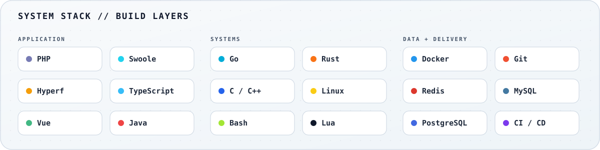

<picture>
  <source media="(prefers-color-scheme: dark)" srcset="./assets/hero.svg" />
  <source media="(prefers-color-scheme: light)" srcset="./assets/hero-light.svg" />
  
</picture>

<p align="center">
  <samp>Backend infrastructure · High-concurrency runtimes · Distributed systems · Developer tooling</samp>
</p>

<p align="center">
  <a href="#02--what-i-build">What I build</a>
  ·
  <a href="#03--original-projects">Original projects</a>
  ·
  <a href="#04--open-source-ecosystem">Ecosystem</a>
  ·
  <a href="#06--github-signal">GitHub signal</a>
  ·
  <a href="mailto:wheakerd@gmail.com">Email</a>
</p>

## `01` / About me

I am a systems architect and infrastructure engineer. I design the foundations behind high-concurrency runtimes,
distributed services, framework internals, and developer platforms—turning complex infrastructure into systems that
remain fast, resilient, and predictable under pressure.

- 🐘 Building high-performance systems with **PHP** and **Swoole**.
- ⚙️ Exploring systems and network software with **Go**, **Rust**, **C**, and **C++**.
- 🐧 Running a Linux-first workflow across Arch, Fedora/CentOS Stream, Debian/Ubuntu, and Kali.
- 🧠 Designing developer tools and AI-agent workflows with explicit boundaries and reliable automation.
- 🧱 Building the **SuperKernel** ecosystem around a Swoole-powered framework for modern PHP.
- 🔬 Maintaining a broad upstream research workspace around runtimes, networking, Linux tooling, and AI development
  tools.

> I care about the foundations: predictable systems, sharp tools, and software that remains understandable under load.

## `02` / What I build

```text
request ──▶ runtime ──▶ concurrency ──▶ data ──▶ observability
              │              │            │
              └──── developer experience & automation ────┘
```

| Area                 | Current direction                                                                 |
|----------------------|-----------------------------------------------------------------------------------|
| Runtime engineering  | PHP compilation paths, PHAR/binary delivery, Swoole coroutine applications        |
| Backend architecture | Long-running services, event-driven workloads, distributed systems foundations     |
| Systems exploration  | Network services and low-level tooling in Go, Rust, C, and C++                    |
| Developer tooling    | Reproducible automation, repository instruction boundaries, AI-assisted workflows |
| Ecosystem design     | Modular packages, framework contracts, Composer integration, reusable components  |

## `03` / Original projects

<table>
  <tr>
    <td width="50%" valign="top">
      <h3><a href="https://github.com/wheakerd/axiom">axiom</a></h3>
      <p><em>Think before AI thinks.</em></p>
      <p>Guardrails and structured workflows for safer, more deliberate AI-assisted engineering.</p>
      <p><code>Python</code> <code>AI workflows</code> <code>Safety</code></p>
    </td>
    <td width="50%" valign="top">
      <h3><a href="https://github.com/wheakerd/mimic">mimic</a></h3>
      <p><em>Transparent AOP for PHP.</em></p>
      <p>A transparent AOP library for PHP with runtime interception.</p>
      <p><code>PHP</code> <code>AOP</code> <code>Runtime</code></p>
    </td>
  </tr>
</table>

<p align="center">
  <a href="https://github.com/wheakerd?tab=repositories&amp;type=source">all source repositories</a>
</p>

## `04` / Open-source ecosystem

| Ecosystem                                      | Public footprint                               | Engineering surface                                                                                                                         |
|------------------------------------------------|------------------------------------------------|---------------------------------------------------------------------------------------------------------------------------------------------|
| [SuperKernel](https://github.com/super-kernel) | 39 repositories, 32 primarily written in PHP | Bootstrap metadata, Composer integration, dependency injection, events, scanning, HTTP services, runtime contexts, isolation, and packaging |

<p align="center">
  <code>60 public repositories</code>
  ·
  <code>8 original projects</code>
  ·
  <code>39 ecosystem repositories</code>
</p>

## `05` / Systems toolbox

<picture>
  <source media="(prefers-color-scheme: dark)" srcset="./assets/stack.svg" />
  <source media="(prefers-color-scheme: light)" srcset="./assets/stack-light.svg" />
  
</picture>

## `06` / GitHub signal

<picture>
  <source media="(prefers-color-scheme: dark)" srcset="https://raw.githubusercontent.com/wheakerd/wheakerd/output/readme-tools_github-readme-stats-dark.svg?v=5" />
  <source media="(prefers-color-scheme: light)" srcset="https://raw.githubusercontent.com/wheakerd/wheakerd/output/readme-tools_github-readme-stats.svg?v=5" />
  
</picture>

<br />

<picture>
  <source media="(prefers-color-scheme: dark)" srcset="https://raw.githubusercontent.com/wheakerd/wheakerd/output/platane_grid_snake-dark.svg?v=2" />
  <source media="(prefers-color-scheme: light)" srcset="https://raw.githubusercontent.com/wheakerd/wheakerd/output/platane_grid_snake.svg?v=2" />
  
</picture>

## `07` / Open channel

If you are working on runtime performance, PHP infrastructure, Linux tooling, distributed backends, or thoughtful AI
automation, there is a good chance we will have something useful to discuss.

<p align="center">
  <a href="mailto:wheakerd@gmail.com"><strong>wheakerd@gmail.com</strong></a>
  <br />
  <sub>Code, Linux, systems, and open source are always welcome.</sub>
</p>

<p align="center">
  <samp>Build deep. Ship clean. Keep the system legible.</samp>
</p>
