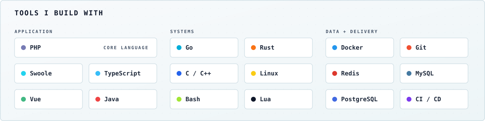

<picture>
  <source media="(prefers-color-scheme: dark)" srcset="./assets/hero.svg" />
  <source media="(prefers-color-scheme: light)" srcset="./assets/hero-light.svg" />
  
</picture>

  <a href="#selected-projects">Projects</a>
  ·
  <a href="#superkernel">SuperKernel</a>
  ·
  <a href="#systems-toolbox">Toolbox</a>
  ·
  <a href="#get-in-touch">Contact</a>

---

## Systems that stay understandable.

I am a systems architect and infrastructure engineer focused on PHP runtimes, backend infrastructure, and developer
tooling. I build framework components, packaging tools, and automation that make systems easier to run and maintain.

<table>
  <tr>
    <td width="33%" valign="top">
      
 &nbsp; <samp>RUNTIME</samp>

      <h3>PHP + Swoole</h3>
      
High-performance PHP runtimes and services.

    </td>
    <td width="34%" valign="top">
      
 &nbsp; <samp>SYSTEMS</samp>

      <h3>Go · Rust · C/C++</h3>
      
Distributed systems, network software, and tooling.

    </td>
    <td width="33%" valign="top">
      
 &nbsp; <samp>TOOLING</samp>

      <h3>Linux · Automation</h3>
      
Containers, reproducible workflows, and tools.

    </td>
  </tr>
</table>

---

## Selected projects

  <a href="https://github.com/wheakerd?tab=repositories&amp;type=source">View all projects →</a>

<table>
  <tr>
    <td width="50%" valign="top">
      <h3><a href="https://github.com/wheakerd/axiom">axiom</a></h3>
      
<em>Workflow guardrails for Codex.</em>

      
Explicit scope, authorization, evidence, and rollback for consequential actions in AI-assisted development.

      
<code>Developer tooling</code> <code>AI workflows</code>

    </td>
    <td width="50%" valign="top">
      <h3><a href="https://github.com/wheakerd/mimic">mimic</a></h3>
      
<em>Transparent AOP for PHP.</em>

      
Intercepts class loading and transforms PHP syntax trees to add behavior without manual proxies or edits to original source files.

      
<code>PHP</code> <code>AOP</code> <code>AST</code>

    </td>
  </tr>
</table>

---

## SuperKernel

[SuperKernel](https://github.com/super-kernel) brings together reusable PHP components for Swoole applications,
from bootstrap and dependency injection to HTTP services and runtime context management.

Start with the [project template](https://github.com/super-kernel/super-kernel-skeleton), or explore the
[bootstrap](https://github.com/super-kernel/bootstrap), [dependency injection](https://github.com/super-kernel/di),
and [event dispatcher](https://github.com/super-kernel/event-dispatcher) components.

---

## Systems toolbox

<picture>
  <source media="(prefers-color-scheme: dark)" srcset="./assets/stack.svg" />
  <source media="(prefers-color-scheme: light)" srcset="./assets/stack-light.svg" />
  
</picture>

## GitHub activity

Public repository statistics across my profile and the SuperKernel organization, refreshed daily.

<picture>
  <source media="(prefers-color-scheme: dark)" srcset="https://raw.githubusercontent.com/wheakerd/wheakerd/output/readme-tools_github-readme-stats-dark.svg?v=5" />
  <source media="(prefers-color-scheme: light)" srcset="https://raw.githubusercontent.com/wheakerd/wheakerd/output/readme-tools_github-readme-stats.svg?v=5" />
  
</picture>

 

<picture>
  <source media="(prefers-color-scheme: dark)" srcset="https://raw.githubusercontent.com/wheakerd/wheakerd/output/platane_grid_snake-dark.svg?v=2" />
  <source media="(prefers-color-scheme: light)" srcset="https://raw.githubusercontent.com/wheakerd/wheakerd/output/platane_grid_snake.svg?v=2" />
  
</picture>

---

## Get in touch

For project questions and bug reports, open an issue in the relevant repository. For collaboration around PHP
infrastructure, runtime performance, Linux tooling, or developer automation, reach me by email.

  <a href="mailto:wheakerd@gmail.com"><strong>wheakerd@gmail.com</strong></a>

  <samp>Build deep. Ship clean. Keep the system legible.</samp>

